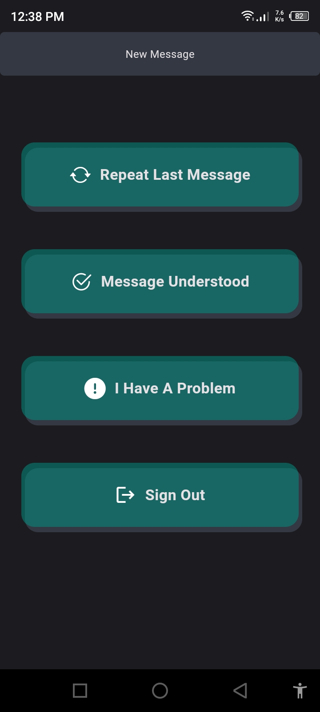
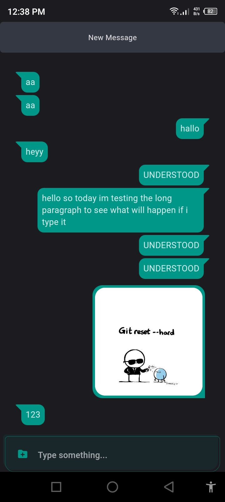

# ChatNest
ChatNest is a streamlined messaging app designed for seamless communication through text, images, files, and audio. Built with simplicity and efficiency in mind, this chat platform offers a clutter-free environment, fostering engaging conversations and smooth media sharing experiences.

## Key Features
### Text Messaging
Engage in lively conversations with friends, family, or colleagues using text-based communication in a clean and intuitive chat interface.
### Image Sharing
Share vibrant moments instantly by exchanging images within the chat, enhancing communication with visual content.
### File Transfer
Seamlessly send and receive files of various formats, ensuring efficient sharing of documents, presentations, and more.
### Audio Messages
Express yourself through voice messages, delivering spoken content for a more personal and expressive chat experience.
### Media Accessibility
Easily access and view shared content directly within the app, allowing convenient access to text, images, files, and audio messages.
### Security and Privacy
Ensure the safety of your conversations with end-to-end encryption, providing a secure environment for your communication.
ChatNest simplifies communication by focusing on essential media types, streamlining your chat experience and enabling effortless exchange of diverse content types.

## Installation
Experience the seamless messaging features of ChatNest by downloading the app from the Google Play Store or Apple App Store. Join the chat community, share moments, and connect effortlessly with friends through a versatile and efficient messaging platform.

  
  
  

